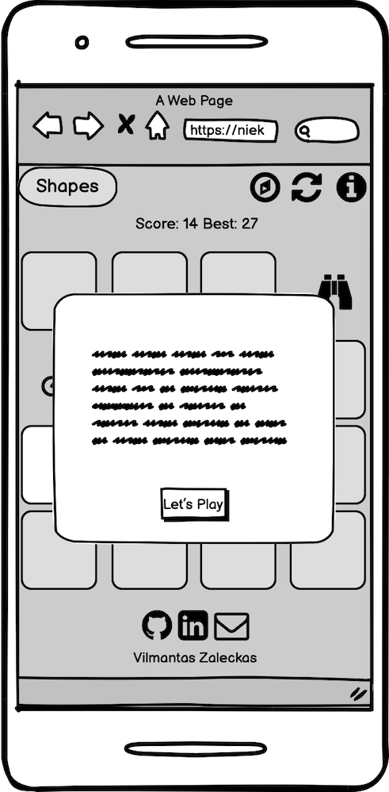
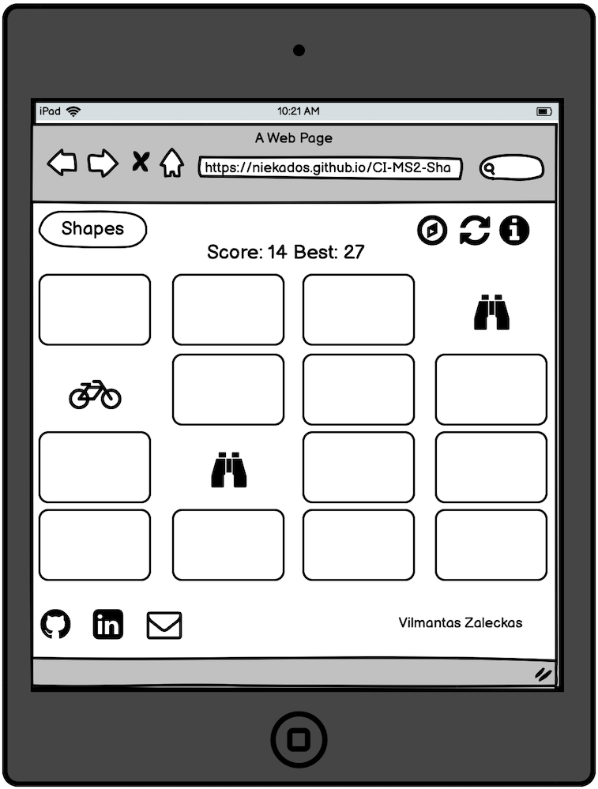
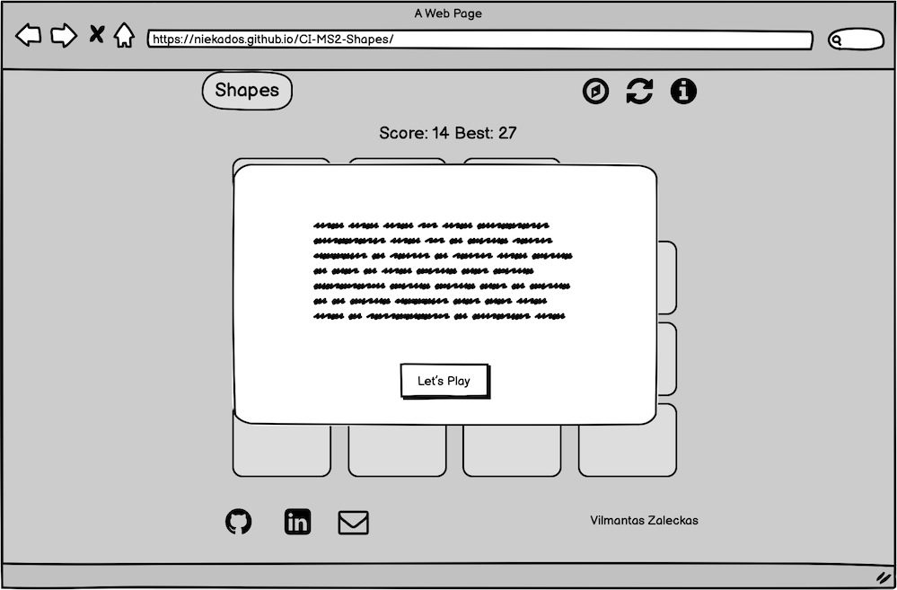

# Vilmantas Zaleckas
## Code Institute Second Milestone Project 
## **Shapes**- Memory Game

A simple memory game of shapes, a fun project created for Code Institutes Interactive Frontend Development Milestone Project.

## Index

- [Strategy](#strategy)
- [Scope](#scope)
- [User Stories](#user-stories)
- [Structure](#structure)
  - [Mobile](#mobile)
  - [Tablet](#tablet)
  - [Desktop](#desktop)
- [Features](#features)
- [Design](#design)
- [Wireframes](#wireframes)
- [Technologies Used](#technologies-used)
- [Deployment](#deployment)
- [Credits](#credits)
- [Testing](#testing)

## Strategy 

* Simple, one-page memory game website for training users memory.
* Website for the user to spend their spare free time and have fun matching shapes.
* Game of Shapes, uncovering and matching two pairs of Shapes, by removing cards from the table(screen).
* Free game to visit, without any advertising or unnecessary information. It's just a game.

## Scope

Simple, distraction-free layout for a visual game of shapes, with few light pastel colours, to keep game experience light, distraction-free and not heavy on the eyes. 
This is the game of shapes, it will mainly consist of symbols("Shapes")- user will play with shapes and symbols will be guiding the user through the game and page navigation, very little written words, with an exception for logo and game instructions, as well as pop up message at the end of the game to congratulate user for matching all shapes. 
* Game will consist of one page and will include:
 1. Header with game logo and navigation buttons.
 2. Score area to reflect the progress of the game, as well as best score, to have an objective for the user to improve on.
 3. Game area (Game Board) where 16 cards (8 pairs of shapes) will be randomly placed on the game area.
 4. Footer with social/contact links and creators name.

## User Stories

* I am a person looking to test and train my memory in a simple and fun way by playing an online game.
* I am a child looking to spend some time online and play a game ( I may be unaware that in the process of playing this game and having fun, the game may train my attention and memory ).
* I am a teacher looking to find material for my students to train their memory skills and have fun in the process.
* I am an elderly person looking to exercise my memory.
* I am an educator looking to find out what nowadays technologies could offer for the eduction.
* I am a person looking to have fun by playing a game during my free time.

### User Goals

#### First Time Visitor

* I'd like to play a simple game.
* I'd like to be able to read instructions on how to play the game.
* I'd like to be able to track my progress with a scoring system.
* I'd like to challenge myself by tracking and trying to beat the best score and increase the interest in games replayability.
* I'd like to play the game which has a pleasant appearance to the eye.
* I'd like to know who created the game and be able to contact that person or see his social links for other projects.

#### Retrurning Visitor

* I'd like to play the game again.
* I'd like to continue training my memory skills.
* I'd like to improve my game skills and beat the best score.
* I'd like to contact the game creator.
* I'd like to check other projects of the creator.

## Structure

### Mobile

* Simplistic appearance.
* 3 interactive buttons centred in the header: "Change game shapes", "Restart the game", "Information (Game rules)".
* Score area with current turns taken and best score centred under the header.
* Game area taking the full width of the screen, with 4 game cards in a row, 4 rows in total.
* Cards will be smaller compared to desktop or tablet screens.
* Footer with Social links centred.

### Tablet

* Simplistic appearance.
* Header taking the full width of the screen, "Shapes" Logo on the left side of the header and 3 interactive buttons on the right side: "Change game shapes", "Restart the game", "Information (Game rules)".
* Score area taking the full width of the screen with current turns taken and best score centred under the header.
* Game area taking the full width of the screen, with 4 game cards in a row, 4 rows in total. 
* Footer taking the full width of the window with social links on the left side, creators name on the right side.

### Desktop

* Simplistic appearance.
* Header taking 60% of windows width. "Shapes" Logo on the left side of the header and 3 interactive buttons on the right side: "Change game shapes", "Restart the game", "Information (Game rules)".
* Score area taking 60% of windows width with current turns taken and best score centred under the header.
* Game area taking 60% of the window, with 4 game cards in a row, 4 rows in total. 
* Footer taking 60% of the window with social links on the left side, creators name on the right side.

## Features

### Implemented

The main purpose of the webpage is the game and for this reason, it will have only logo and game control buttons in the header.
The logo will be just a name: "Shapes". It has to be as simple as possible and just a short name describes the purpose and the idea of the game, as you will be playing with shapes. This will be located on the left side of the header. Game control buttons: 
* "Change Shapes" - button which will toggle between 3 types of shapes, giving the game a bit of variety for replayability.
* "Restart Game" - button to restart the game, if the user made a mistake or exceeded turns for achieving best score, restarting the game will keep the best score, opposed to reloading the page, which will clear game stats. 
* "Information"- game rules and minimal descriptions of game buttons". 
Buttons will be on the right-hand side of the header. Once the page is loaded user will be greeted with a welcome message and game objectives explanation, the button at the bottom saying "Let's go!", setting the mood for having fun and taking the challenge. 

The score bar will be located at the top of the game area, for it to be easy and intuitive to track or look up at your present score. If the user is up for a challenge, there is a section for "Best" score to track the progress.

The game area will be clean, without borders or anything distractive around, so the user can concentrate all his attention on the game.
Game cards will be positioned with 4 cards per row and 4 cards per column. 
The game will be played by removing two cards from the game area, which will uncover different shapes on the game board, once two cards are matched they stay uncovered until all 8 pairs of cards are found and the game will notify the user with a pop-up message, that game is over. The ultimate game goal is to uncover all game cards by taking the least turns.  

Footer will inherit the simplicity of the header and game area, will have 3 social links with the email, LinkedIn profile page and the GitHub page for user to have availability to follow up with comments, compliments or new project ideas.

### Enchansments For Fututre

* Possibility of changing colour themes, as well as black and white theme, which would work very well with these shapes.
* If there will be any requests or interest from users, there would be a possibility to add a timer for an extra layer of challenge, but at the moment it was not implemented, as the game idea was to train memory and at the same time to relax, rather than rushing through it.
* Add few more games with shapes, to have a place for the user to come back even more often.
* Have a user base, for users to be able to track their progress and not losing it after leaving the page.

## Design

The design idea for the game is to have lightness and simplicity on the eyes and mind of the user. Rounded shapes, pastel colours and minimal written words will be used to achieve this impression. Logo, buttons and game elements will have shadows attached to create a 3D effect of elevation over the game board, which will be an important feature to create an illusion of cards hovering over the board and the user just removing them and uncovering symbols imprinted on the board. Buttons will have feedback on mouse hover by inverting the colour palette between symbols colour and its background. 

* Logo - to be simple and tell the user the story and the purpose of this page at a glance, for this reason only the word "Shapes" will be used, as the user will be playing with shapes, as well as game controls (navigation) will also consist only of shapes. It Will have a rounded border and the same background as the game control buttons, to have a nice symmetric balance between both sides of the header. Due to the absolute minimal (aiming to eliminate most written words) page design, the logo will use the same fonts as the rest of the page to keep the connection and fluidity between the written elements of the game.

* Buttons (game controls/navigation) - will share rounded styling with the same colours as logo and will have symmetric header balance. Each button will consist of only one symbol ("Shape"), it will have a round shape. The first button will be the game board switch one. It will cycle between different shape collections and after each click, it will change the symbol to represent the current collection selection. The button will cycle between the Frog symbol (representing animals collection), the Compass symbol(representing adventure collection) and the Apple symbol(representing Food collection). It will be followed by a restart button, which will be just a static spinning arrow symbol, representing refresh, recycle. And the last button will be the information button with game rules, "i" (information), which will call the pop-up window with game information.

* Score area - very basic, without any borders or formatting, except inheriting colour from Logo and buttons background, to have a connection and nice migration between elements. As only one font style will be used across all the written words and numbers on the board, it will have the same font as Logo and Game Instructions.

* Game Board (game area) - will have the same background colour as the whole body of the page to keep fluidity and connection between page elements. Game symbols will be randomly placed on the board and will be the same colour as Logo, game buttons and game score, keeping the same theme and game design idea with having few colours. On the other hand, game cards will introduce pastel yellow colour to stand out among other page elements, as it will be the main area where users will have to concentrate their attention while taking the challenge. Cards will also have rounded borders and will cast the shadow simulating the hovering effect and when the user clicks on them they will disappear revealing symbol hidden under them.

* Footer - will keep the same colour theme and round border as the header elements as well as other game elements. Will have the logo of social links: Github, LinkedIn and Email. Social links will be slightly smaller than game control buttons, but will have the same colour theme and will invert colours between symbol colour and background colour. Social links will be positioned on the left-hand side of the screen for tablet and desktop, and for mobile, it will centre on the footer. The left-hand side of the footer will have the creators name with the same fonts family as the score area and logo and will also have the same font colour as game shapes and game scores, creators name will disapear on the mobile version and will stay on the right side for desktops and tablets.

* Pop up messages - there will be three pop up messages appearing for different user actions. 
 1. The first one will pop up upon loading the page and welcome the user to the "Shapes" game and will give short instructions on how to play the game and its objectives, keeping the same colour palette as the rest of the text on the page. It will have only one button at the bottom inviting the user to start the game: "Let's Play!". 
 2. Second pop up message will be called out by pressing the game control button "i" and will remind the user of game rules and objectives, also will have game control buttons explained.
 3. Third pop up message will appear on matching all 8 types of shapes on the game board and will congratulate the player on completing the game.

* Colours: 

Body Background colour: #d9fbf4

Logo, game buttons and text font colour: #6289a2

Game cards colour: #ffd261

The choice of colours was driven by the idea to create a light and gentle atmosphere to relax while playing, also for the user to be able to spend a prolonged time looking and the page and not be overwhelmed by the variety or intensity of the colours. As the page is very simple in its design, there shouldn't be too many colours or distractions. For this reason, three pastel colours were chosen.

* Background - very gentle blue colour with a tiny hint of green, it is a very relaxing colour, pleasant to the viewer's eye and doesn't strain eyes, nor mind.
* Text colour and buttons background - also a gentle deeper blue mixed with grey colour, it brings a nice contrast with light blue body colour and makes letters readable, at the same time slightly blending in. Having that pastel feel and enough contrast will make the text stand out.
* Game Cards - as this is the game, something has to stand out - the playing cards are the most important part of the game. They are highlighted with muddy yellow, which takes attention to the centre of the screen, but stays pastel and light for the user's eyes.

### Typography

Criteria for the fonts were:
* Easy to read. 
* Roundy letters, without sharp edges (To complement the overall look of all the shapes, buttons and game cards on the page).
* Have a hint of playfulness. 
As the user will encounter such a small amount of written words on the page, only one font was enough, also keeping one font allows seemingly connecting all page elements.

Out of all available fonts on the Google Fonts site, I found the most suitable font for this project - "Nunito" Designed by Vernon Adams, Cyreal. 

## Wireframes

### Mobile 

### Mobile Pop-Up Message

### Tablet

### Tablet Pop-Up Message

### Desktop

### Desktop Pop-Up Message

*You can access Wireframes .pdf file [here](assets/wireframes/ShapesWireframes.pdf)* 

## Technologies Used

- [HTML5](https://en.wikipedia.org/wiki/HTML5)
- [CSS3](https://en.wikipedia.org/wiki/CSS) 
- [GitHub](https://github.com) 
- [GitPod](https://www.gitpod.io)
- [Balsamiq](https://balsamiq.com/) - for wireframes creation.
- [Google Fonts](https://fonts.google.com)
- [favicon.io](https://favicon.io/) - Favicon generator to create favicon and make it compatible with different browsers.
- [Autoprefixer](https://autoprefixer.github.io/) - parses CSS and adds vendor prefixes to CSS rules.
- [Sweetalert2](https://sweetalert2.github.io/) - Responsive, Customizable JavaScript's Popup Boxes. Used for creating game popups.

## Deployment

This project was developed with the GitPod platform and has been deployed on GitHub following these steps:

1. Go to [GitHub](https://github.com/).
2. Log in to my [account](https://github.com/niekados).
3. Find repository [CI-MS2-Shapes](https://github.com/niekados/CI-MS2-Shapes) and open it.
4. Click on [settings](https://github.com/niekados/CI-MS2-Shapes/settings) tab.
5. Select the "Pages" vertical tab on the left side of the screen.
6. Under the "Source" section click the "branch" drop-down menu and select the "master" branch.
7. Click the "Save" button.
8. Page has been deployed! The link to deployed [page](https://niekados.github.io/CI-MS2-Shapes/) will appear above the "Source" section. 

To run the project locally

1. Go to [GitHub](https://github.com/).
2. Log in to my [account](https://github.com/niekados).
3. Find repository [CI-MS2-Shapes](https://github.com/niekados/CI-MS2-Shapes) and open it.
4. Click the green "Code" button for the drop-down menu to appear.
5. You can clone the repository by copying the HTTPS link to your desktop IDE.
6. Alternatively you can download the ZIP file and extract it onto your computer.  
 

 ## Credits

* Big thank you to Ania Kubow for her YouTube tutorial "Make MEMORY GAME in JavaScript, HTML and CSS for your portfolio" ([link](https://www.youtube.com/watch?v=tjyDOHzKN0w&t=81s)), which helped me a lot to understand the structure of the game and implement it in my project. Her YouTube channel [link](https://www.youtube.com/channel/UC5DNytAJ6_FISueUfzZCVsw).
* [w3schools](https://www.w3schools.com) for all the code references.
* [Sweetalert2](https://sweetalert2.github.io/) for providing such a helpful and simple popup tool.

### A very special thank you

I want to thank everyone who was a big part of the path towards finishing this project when the Milestone Project became not only a coding challenge but also a personal one. 

* I want to say a special thank you to Alexander Farrell from Code Institute, for his patience, friendliness and understanding. He was the first person to hear me, he was the first person to support and encourage me when things were not going well. Just want to say, Alexanders help meant the world to me and changed it.  
* My sister was always checking on me, on my progress, listening and believing in me.
* Silvia, who was always there, even at moments when I was not.
* Maria, who was greatest distraction and greatest inspiration.
* Doctor Jolanta, for helping me to piece together and to go for success!  

## Testing

HTML Code has been tested for each individual page with [W3C Markup Validator](https://validator.w3.org/) and [W3C CSS Validator](https://jigsaw.w3.org/css-validator/):

### style.css

